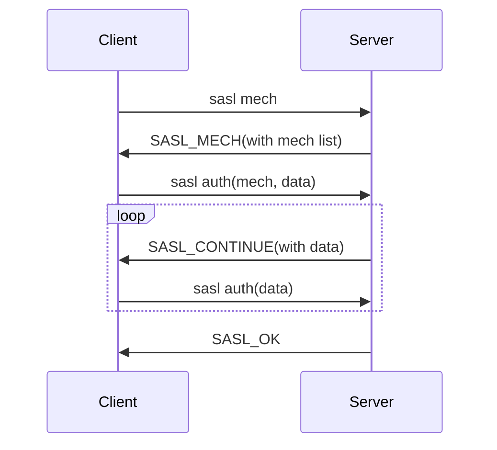

# 12. SASL 명령

ARCUS Cache Server와 연결을 맺은 클라이언트는 아래와 같은 흐름으로 인증 과정을 수행한다.



SCRAM-SHA-256 인증은 다음과 같이 이루어진다.
1. (optional) `sasl mech` 명령 전송하여 서버가 지원하는 인증 방식 확인
2. `SCRAM-SHA-256` 인증 방식으로 client-first-message 생성하여 `sasl auth`(start) 명령 전송
3. ARCUS Cache Server는 client-first-message 확인하고 `SASL_CONTINUE`(with server-first-message) 응답
4. server-first-message 바탕으로 client-final-msssage 생성하여 `sasl auth`(step) 명령 전송
5. ARCUS Cache Server는 client-final-message 확인하고 `SASL_CONTINUE`(with server-final-message) 응답
6. server-final-message 확인하고 이상이 없으면 empty body와 함께 `sasl auth`(step) 명령 전송
7. 인증 성공(`SASL_OK`)

> [!NOTE]
> SASL 인증 기능 활성화 된 서버에 요청 전송할 때, 해당 명령을 수행할 권한이 없는 경우 `CLIENT_ERROR unauthorized` 응답을 반환합니다.

SASL 인증에 관한 명령은 아래와 같다.

- [sasl mech 명령](#sasl-mech)
- [sasl auth 명령](#sasl-auth)

<a id="sasl-mech"></a>
## sasl mech 명령

캐시 서버에서 지원하는 인증방식 목록을 조회한다.

```
sasl mech\r\n
```

성공 시의 response string은 아래와 같고, SCRAM-SHA-256 인증 방식만 지원함을 나타낸다.

```
SASL_MECH SCRAM-SHA-256\r\n
```

실패 시의 response string과 그 의미는 아래와 같다.
| Response String | 설명 |
| - | - |
| "NOT_SUPPORTED" | SASL 인증 기능이 off 상태 |
| "ERROR unknown command" | SASL 인증 기능이 없는 캐시 서버 |
| "CLIENT_ERROR bad command line format" | protocol syntax 틀림 |

<a id="sasl-auth"></a>
## sasl auth 명령

주어진 인증 방식에 따라 인증 과정을 수행한다. 인증 방식 인자의 포함 여부에 따라 새로운 인증 과정 시작(start)인지, 이전 인증 요청을 이어서 수행(step)하는 것인지 구분한다.

1. start: 클라이언트가 선택한 인증 방식으로 인증 과정을 시작한다.

cyrus-sasl library 사용하는 경우를 예시로 들면, `sasl_client_start()` 호출하여 얻는 반환값(client-first-message)을 `<data>`로 전달할 수 있다.

```
sasl auth SCRAM-SHA-256 <bytes>\r\n
<data>\r\n
```

2. step: 이전 sasl auth 명령에서 ARCUS Cache Server가 `SASL_CONTINUE`를 응답한 경우, 추가 데이터를 전달한다.

cyrus-sasl library 사용하는 경우를 예시로 들면, `sasl_client_step()` 호출하여 얻는 반환값(client-final-message 또는 empty-message)을 `<data>`로 전달할 수 있다.

```
sasl auth <bytes>\r\n
<data>\r\n
```

성공 시의 response string은 아래와 같다.
```
SASL_OK\r\n
```
SCRAM-SHA-256 인증 진행을 위해 서버는 인증에 필요한 추가 데이터를 전달하며 sasl auth 명령을 재요청할 수 있다. 클라이언트는 서버가 전달한 값을 바탕으로 `SASL_OK` 응답(또는 실패 응답)을 수신할 때까지 step 명령을 전송해야 한다.
```
SASL_CONTINUE <bytes>\r\n
<data>\r\n
```

실패 시의 response string과 그 의미는 아래와 같다.
| Response String | 설명 |
| - | - |
| "NOT_SUPPORTED" | SASL 인증 기능이 off 상태 |
| "AUTH_ERROR" | 지원하지 않는 인증 방식 or username/password 틀림 |
| "ERROR unknown command" | SASL 인증 기능이 없는 서버 |
| "CLIENT_ERROR bad command line format" | protocol syntax 틀림 |
| "SERVER_ERROR out of memory" | 메모리 부족 |
